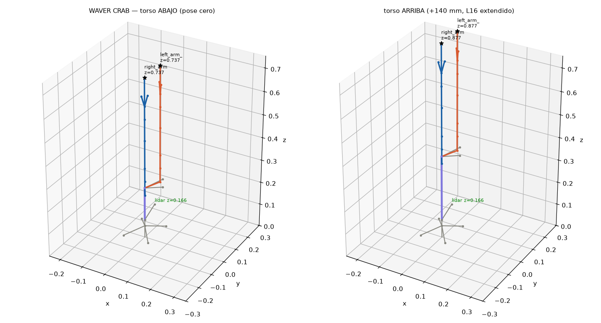

# ROS2_Docker_twin — Gemelo digital WAVER CRAB (Fase F1)

Workspace del gemelo digital: URDF/xacro del robot completo de la demo maratón
(rover + módulo TORSO elevable + 2 brazos 6DOF de aluminio a ±45°). Corre en el
computador de desarrollo (Mac/PC), **no** en la Pi.

## Contenido

```
ros2_ws/src/waver_arm_description/
├── urdf/
│   ├── arm_6dof.xacro          # macro del brazo (se instancia 2 veces)
│   ├── arm_standalone.urdf.xacro  # 1 brazo en pedestal (estudio/calibración)
│   ├── waver_crab.urdf.xacro   # ensamble completo: rover+TORSO+2 brazos
│   └── materials.xacro
├── launch/display.launch.py    # RViz + sliders por joint
└── rviz/twin.rviz
```

## La cadena del brazo (del manual del kit, 30 pág.)

| Servo | Joint URDF | Eje |
|---|---|---|
| A | `*_yaw_joint` (base sobre rodamiento) | Z |
| B | `*_shoulder_joint` | Y |
| C | `*_elbow_joint` (bloque doble servo) | Y |
| D | `*_wrist_pitch_joint` | Y |
| E | `*_wrist_roll_joint` | Z local |
| F | `*_finger_l_joint` + `*_finger_r_joint` (mimic ×-1, garra de engranajes) | X local |

Además: `torso_lift_joint` **prismática** (Actuonix L16-140: 0–0.14 m,
100 N, 0.02 m/s) entre el sub-chasis y la placa-torso.

⚠️ Todas las longitudes están marcadas `[calibrar]` en `arm_6dof.xacro`:
son estimadas de las fotos del manual. Al llegar el kit se miden con
calibrador y se corrigen las propiedades UNA vez.

## Cómo visualizarlo (reusa la imagen de ROS2_Docker_UI)

```bash
cd ROS2_Docker_UI && ./scripts/build   # si aún no existe la imagen

docker run -it --rm \
  -e DISPLAY=$DISPLAY -v /tmp/.X11-unix:/tmp/.X11-unix \
  -v "$(pwd)/../ROS2_Docker_twin/ros2_ws:/ros2_ws" \
  ros2_ui_image bash -c \
  "cd /ros2_ws && colcon build --symlink-install && source install/setup.bash && \
   ros2 launch waver_arm_description display.launch.py"
```

Con `model:=arm_standalone.urdf.xacro` se ve un solo brazo en pedestal.
Mueve los sliders del `joint_state_publisher_gui`; el dedo derecho es mimic
del izquierdo (la garra de engranajes se espeja sola).

## Validación sin ROS (en la Mac pelada)

`pip install xacro urdf-parser-py` y el script de la sesión (scratchpad)
procesa los xacro y verifica árbol/nombres/límites. Última corrida:
ambos modelos ✅ (CRAB: 29 links, 28 joints, 15 móviles, 6.26 kg;
masa elevada 2.4 kg ≤ 4 kg regla D3 ✓).

## F1b — capa de control (2026-07-09)

```
ros2_ws/src/
├── waver_arm_description/
│   ├── urdf/control.xacro            # ros2_control + plugin gazebo_ros2_control
│   ├── urdf/waver_crab_sim.urdf.xacro # CRAB + capa de control (para Gazebo)
│   ├── config/controllers.yaml       # JTC por brazo + torso + grippers
│   ├── config/kinematics.yaml        # IK (KDL; TRAC-IK = 1 línea de cambio)
│   └── srdf/waver_crab.srdf          # grupos MoveIt2, poses candle/compact
└── waver_arm/                        # el nodo de control real/mock
    ├── waver_arm/servo_map.py        # joint→canal PCA9685 + ángulo→pulso (PURO)
    ├── waver_arm/pca9685_backend.py  # Mock (default) / Real (exige ARMADO)
    ├── waver_arm/arm_controller_node.py  # rampa segura + /joint_states
    └── test/test_servo_map.py        # 19 tests (incluye la regla de oro)
```

Mapa de canales PCA9685: brazo izq A-F = 0-5, brazo der A-F = 6-11,
L16 torso = 12. Grupos MoveIt2: `left_arm`/`right_arm` (5 joints) +
`*_gripper` + `*_arm_with_torso` (el ascensor como GDL vertical extra).

**Regla de oro codificada**: el nodo arranca en MOCK y DESARMADO;
`RealPca9685(armed=False)` lanza `PermissionError`. Armar = servicio
`/waver_arm/arm` (SetBool) + parámetro `use_mock:=false`, siempre con
confirmación explícita de Andrés.

## Smoke test (contenedor waver_twin)

```bash
cd ROS2_Docker_twin && docker build -t waver_twin .
docker run --rm -v "$(pwd)/ros2_ws:/ros2_ws" -v "$(pwd)/scripts:/scripts" \
  waver_twin bash /scripts/smoke_test.sh
```

Valida: colcon build, 19 unit tests, xacro de los 3 modelos, y un E2E:
el nodo mock recibe "torso a 0.14" y TF confirma que `left_arm_tool0`
sube de z=0.737 a z=0.877 respetando los 20 mm/s del L16 (~7 s).

## Pendiente F1 (con Andrés)

1. Ver el CRAB en RViz (X11) y grabar el primer short 🎬.
2. Gazebo con física + MoveIt2 demo (mini-clase ros2_control + IK).
3. Decidir KDL vs TRAC-IK con pruebas reales.

## Verificación FK (pose cero)



Cinemática directa calculada del URDF: brazos simétricos (y = ±0.058),
`tool0` sube 0.737 → 0.877 m con el L16 extendido (+140 mm exactos) y el
LiDAR permanece a z = 0.166 en ambas poses (decisión D1b ✓).
